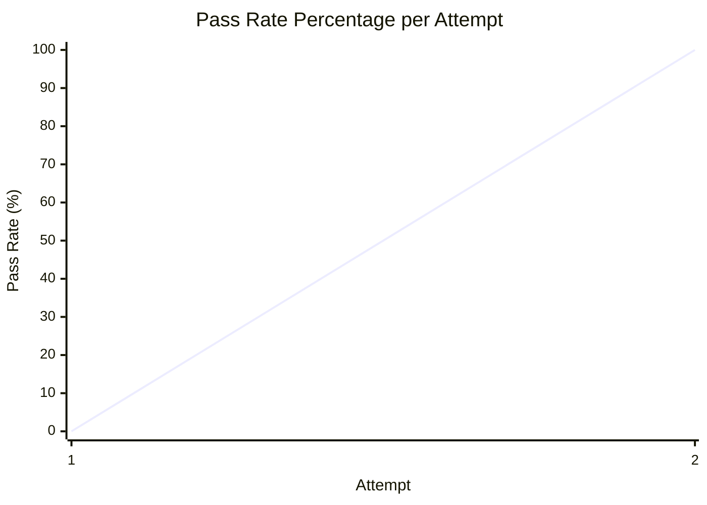

# Test Performance Report

## Iteration Progress

The following chart illustrates the pass rate percentage over the number of attempts required to reach a fully passing test suite (100%).

*Note: Attempt 1 resulted in a compilation error (build failed), therefore the pass rate is represented as 0%. Attempt 2 achieved a 100% pass rate with all 19 tests successfully passing.*